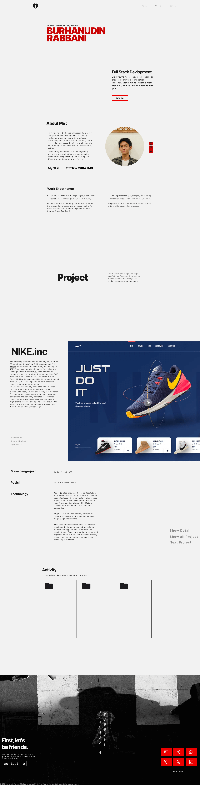
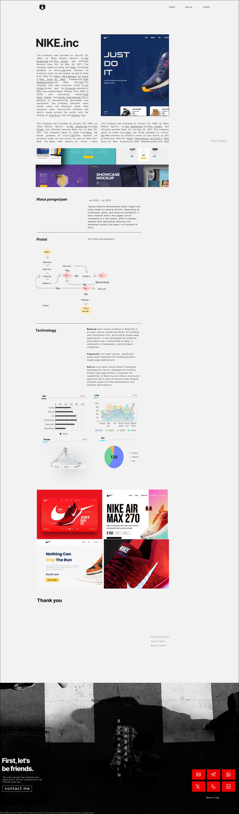
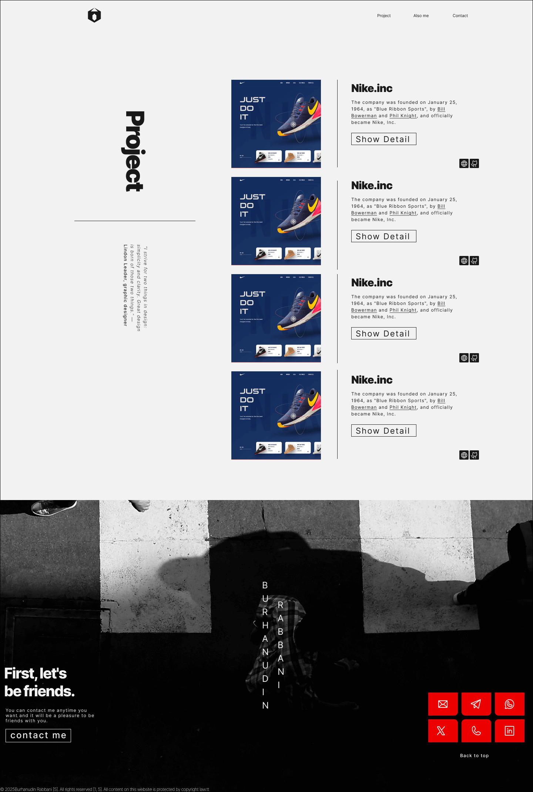
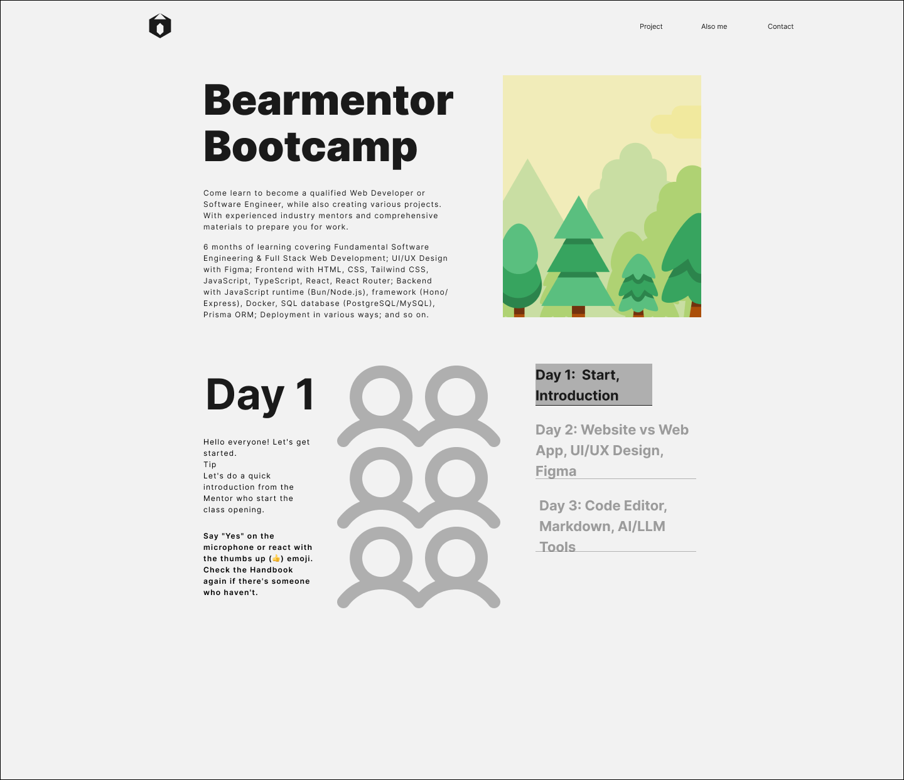

# brabbani.com

Hi, let me introduce myself. My name is Burhanudin Rabbani. I'm a beginner in web development and currently taking the Bearmentor Bootcamp course. This is Markdown for my personal website, as part of the course assignment. I will develop this Markdown as the course progresses, along with my personal website developer. Thank you.

## Links

- Figma: https://figma.com/design/EXKlqZM6jUT3nMCf7XKO3r/brabbani.com?node-id=0-1&t=ElEnzI8HPoOgV6jB-1
- GitHub: [burhanudinrabbani666](https://github.com/burhanudinrabbani666)
- Website: [brabbani.com//brabbani.com]

## Home

Home have 5 sections

Hero: this page section not final design.

About me: this section tell little bit about my vision and mision. also about my work experience

Project:

In the project homepage, content is displayed on two screens. The first displays the company profile and website results, while the second displays a brief description of the project. There are also three buttons on each screen that can direct you to a more complete and detailed project description page, displaying all previously completed projects, and selecting the next project to be displayed.

### Detail Project Page

### Display Project Page

Activity:

This section will feature three main activities the author undertakes each month. These aren't Instagram posts, but rather self-development activities worth sharing. Each folder will take users directly to a more detailed page.

### Activy Example Page

Footer:

this section show contact

That's a brief explanation of my personal website.

### Let's be friend

| Contact Me | Links                                                           |
| ---------- | --------------------------------------------------------------- |
| Github     | [burhanudinrabbani666](https://github.com/burhanudinrabbani666) |
| Telegram   | [burhanudinrabbani666](https://t.me/burhanudinrabbani666)       |
| Website    | [brabbani.com](https://brabbani.com)                            |
